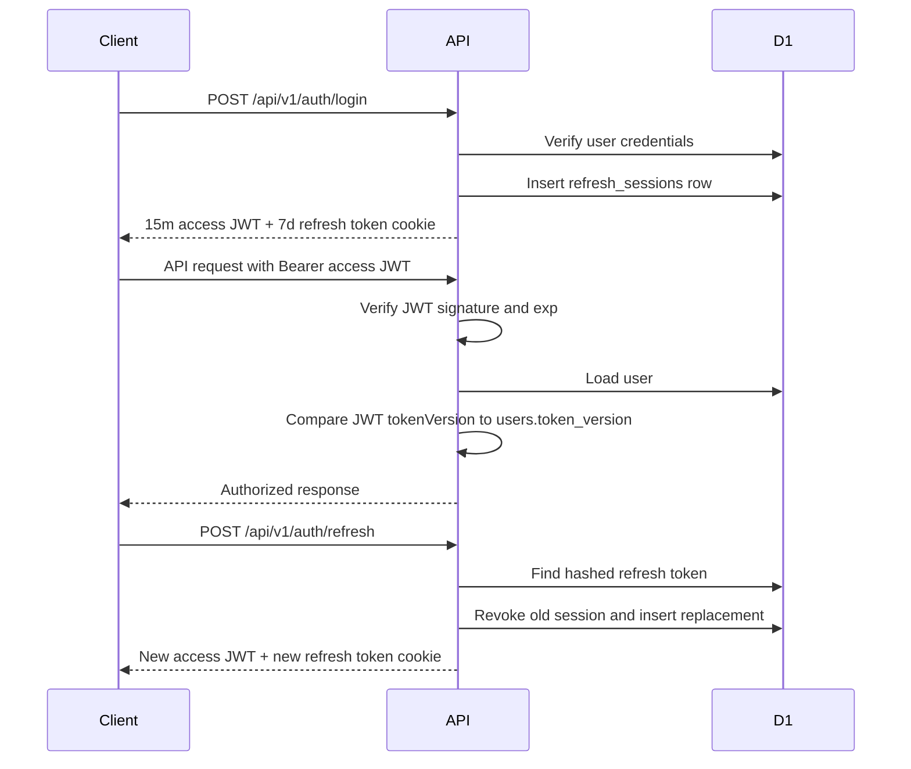
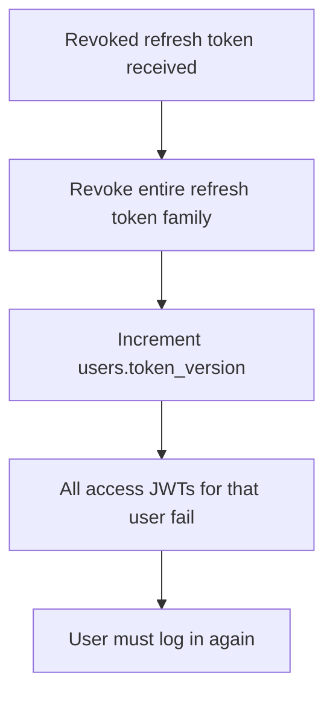

# Backend Auth Architecture

Date: 2026-05-22

Scope: Cloudflare Workers + Hono + D1 JWT session architecture.

## Summary

The backend now supports a modern rotating-session model under `/api/v1/auth/*` while keeping legacy `/api/auth/*` behavior available for existing clients.

The secure v1 flow uses:

- Short-lived bearer access JWTs: 15 minutes
- Long-lived refresh tokens: 7 days
- Persistent refresh sessions in D1
- Hashed refresh tokens only
- Refresh token rotation on every refresh
- Refresh token reuse detection
- `users.token_version` based global JWT invalidation
- Logout current session
- Logout all devices

## Data Model

`users.token_version`

```sql
ALTER TABLE `users` ADD `token_version` integer NOT NULL DEFAULT 0;
```

`refresh_sessions`

```sql
CREATE TABLE refresh_sessions (
  id TEXT PRIMARY KEY NOT NULL,
  user_id TEXT NOT NULL,
  token_hash TEXT NOT NULL,
  family_id TEXT NOT NULL,
  expires_at TEXT NOT NULL,
  created_at TEXT DEFAULT CURRENT_TIMESTAMP NOT NULL,
  revoked_at TEXT,
  replaced_by TEXT,
  last_used_at TEXT,
  user_agent TEXT,
  ip_address TEXT
);
```

Only `token_hash` is stored. Raw refresh tokens are never persisted.

## Token Lifecycle



## Rotation Flow

1. Client sends refresh token via hardened cookie or JSON body.
2. API hashes the received token with SHA-256.
3. API looks up `refresh_sessions.token_hash`.
4. If session is active and unexpired:
   - create a replacement refresh token
   - insert new session with same `family_id`
   - atomically revoke old session and set `replaced_by`
   - issue new 15-minute access JWT
5. Client discards old refresh token.

## Reuse Attack Handling

If a revoked refresh token is seen again, the API treats it as replay.



This protects against stolen refresh tokens. The cost is intentionally aggressive: reuse burns the whole family and invalidates all access tokens.

## JWT Invalidation

Access JWT payload includes:

```json
{
  "userId": "user_123",
  "email": "user@example.com",
  "tokenVersion": 0,
  "exp": 1770000000
}
```

Auth middleware does all of the following:

1. Verifies JWT signature.
2. Verifies expiration.
3. Loads the user from D1.
4. Rejects deleted users.
5. Compares JWT `tokenVersion` with `users.token_version`.
6. Rejects mismatches with `401`.

`logout-all` increments `users.token_version`, so every existing access token is invalid immediately.

## Cookie Strategy

Refresh token cookie:

- `httpOnly`
- `secure`
- `sameSite=lax`
- `path=/api/v1/auth`
- `maxAge=604800`

This keeps the refresh token unavailable to JavaScript and restricts browser attachment to auth endpoints.

Local development note: because the cookie is `secure`, browsers only persist it over HTTPS. Mobile clients or local HTTP clients can use the JSON `refreshToken` field during development.

## Web vs Mobile

Web:

- Prefer refresh token cookie.
- Store access token in memory when possible.
- Call `/api/v1/auth/refresh` when access expires.

Mobile:

- Store refresh token in the platform secure store.
- Send refresh token in the JSON body:

```json
{
  "refreshToken": "..."
}
```

- Store access token in memory or secure storage depending on app lifecycle needs.

## Endpoints

`POST /api/v1/auth/login`

Returns:

```json
{
  "success": true,
  "data": {
    "token": "access.jwt",
    "accessToken": "access.jwt",
    "accessTokenExpiresIn": 900,
    "refreshToken": "raw-refresh-token-for-mobile-clients",
    "refreshTokenExpiresIn": 604800,
    "user": {
      "id": "user_123",
      "email": "user@example.com",
      "fullName": "User",
      "isPremium": false
    }
  }
}
```

`POST /api/v1/auth/refresh`

Accepts either cookie or JSON body:

```json
{
  "refreshToken": "..."
}
```

`POST /api/v1/auth/logout`

Revokes the current refresh session when a refresh token is supplied by cookie or JSON body.

`POST /api/v1/auth/logout-all`

Requires bearer access JWT. Revokes all refresh sessions and increments `users.token_version`.

## Migration Strategy

1. Apply D1 migrations through `0009_refresh_sessions.sql`.
2. Keep existing clients on `/api/auth/login` temporarily.
3. Move web client to `/api/v1/auth/login` and `/api/v1/auth/refresh`.
4. Move mobile client to `/api/v1/auth/login` and store returned refresh token in secure storage.
5. Reduce reliance on legacy 7-day access JWTs once clients refresh correctly.
6. Later, deprecate legacy `/api/auth/*` login tokens.

## Security Rationale

- Short access token lifetime reduces replay window.
- Refresh rotation makes stolen refresh token reuse detectable.
- D1 session storage enables per-session and all-device revocation.
- `token_version` makes stateless JWTs practically invalidatable.
- Hash-only refresh token storage limits database leak blast radius.
- Cookie path restriction avoids sending refresh tokens to non-auth API routes.
- Deleted users fail auth because middleware loads the user on every authenticated request.

## Remaining Hardening Options

- Add device/session listing and user-facing session revocation.
- Add D1 cleanup job for expired/revoked sessions.
- Add risk scoring for IP/user-agent changes.
- Consider `sameSite=strict` if OAuth/deep-link browser flows do not need lax behavior.
- Consider a peppered HMAC for refresh token hashes if a dedicated secret is added.

